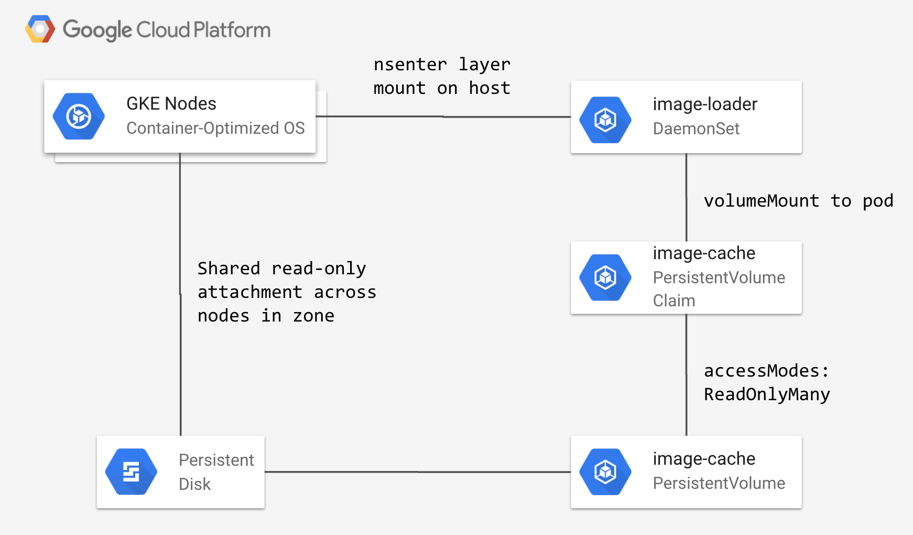

## Selkies node init image cache

## Description

Example showing how to speed up node creation by loading cached images from a read-only persistent disk.

Many of the Selkies images are large, >1GB, this increases the initial node startup time significantly in an environment where autoscaling is critical to cost savings.

This optimization is implemented using a DaemonSet with the read-only persistent disk mounted as a volume claim.

The DaemonSet does the following on host:

1. Creates bind mounts for all of the layers found on the persistent disk into the `/var/lib/docker/overlay2` layer cache directory.
2. Mounts an overlayfs on top of `/var/lib/docker/image` that merges the directory on the host with the directory on the persistent disk.
3. Merges the `/var/lib/docker/image/overlay2/repositories.json` with the host and persistent disk json files using `jq`. This makes all the new images visible for example when when running `docker images`.
4. Restarts the docker daemon by running `systemctl restart docker`, this forces docker to reload the layer and image cache, fully registering the injected images.

> NOTE: this approach is not stable across node reboots as the layer filesystem mounts are not persistent.



## Dependencies

- App Launcher: [v1.0.0+](https://github.com/GoogleCloudPlatform/selkies/tree/v1.0.0)
- WebRTC Streaming Stack: [v1.4.0+](https://github.com/GoogleCloudPlatform/solutions-webrtc-gpu-streaming/tree/v1.4.0) (images only)

## Features

- Accelerated node startup by skiping large image downloads.
- Uses Packer to build GCE disk image with cached docker images.

## Tutorials

## Pre-requisites

This tutorial requires that you have already deployed the Kubernetes App Launcher Operator in your GKE cluster.

If you have not already deployed the operator, follow this Cloud Shell tutorial to do so:

[](https://ssh.cloud.google.com/cloudshell/editor?cloudshell_git_repo=https://github.com/GoogleCloudPlatform/selkies&cloudshell_git_branch=v1.0.0&cloudshell_tutorial=setup/README.md)

This tutorial requires that you have deployed the WebRTC streaming app launcher stack to the cluster.

If you have not installed the WebRTC stack, follow this Cloud Shell tutorial to do so:

[](https://ssh.cloud.google.com/cloudshell/editor?cloudshell_git_repo=https://github.com/GoogleCloudPlatform/selkies-vdi&cloudshell_git_branch=v1.0.0&&cloudshell_tutorial=tutorials/gke/00_Setup.md)

## Configure your environment

1. Set the project, replace `YOUR_PROJECT` with your project ID:

```bash
export PROJECT_ID=YOUR_PROJECT
```

```bash
gcloud config set project ${PROJECT_ID?}
```

## Building the cache disk

1. Set the zone and disk size in gigabytes to provision the disk in:

```
ZONE=us-west1-a
DISK_SIZE_GB=256
```

2. Create the GCE disk image containing a cache of the core Selkies images using Cloud Build and Packer:

```bash
(cd build/selkies-image-cache && gcloud builds submit --project=${PROJECT_ID} --substitutions=_PROVISION_ZONE=${ZONE},_DISK_SIZE_GB=${DISK_SIZE_GB},_USE_LAST_IMAGE="false")
```

> NOTE: you can include other images by adding them to the file: `build/selkies-image-cache/scripts/image_list.txt`

> NOTE: This step pulls __all__ GCR images found in the project that have a `latest` tag and takes about 20 minutes to complete.

3. Create persistent disk from image:

```bash
(cd build/gce-pd && gcloud builds submit --project=${PROJECT_ID} --substitutions=_DISK_ZONE=${ZONE},_DISK_SIZE_GB=${DISK_SIZE_GB})
```

## Installing the DaemonSet

1. Deploy the PersistentVolume, PersistentVolumeClaim and DaemonSet to the cluster:

```bash
REGION=us-west1
```

```bash
(cd manifests && gcloud builds submit --project=${PROJECT_ID} --substitutions=_REGION=${REGION},_DISK_ZONE=${ZONE})
```

> NOTE: this creates 2 DaemonSets, one for the gpu-cos node pool and other for the tier1 node pool. The gpu-cos DaemonSet uses the pre-installed `cos-nvidia-installer:fixed` image, which only exists on nodes with GPUs attached.

## Updating image cache

With this approach for image caching, updating cached images can be more difficult.

WORK IN PROGRESS - The suggested approach for updating a cached image is as follows:

1. Build and push the updated image to GCR.
2. Re-run the `build/selkies-image-cache` Cloud Build step to create a new compute image.
3. Re-run the `build/gce-pd` Cloud Build step to create a new compute disk from the image.
4. Shutdown all launched apps that are currently using the images.
5. Delete the old DaemonSet (postfixed by timestamp), this way a new node doesn't try to run both DaemonSets.
6. Re-run the `manifests/` Cloud Build step to deploy a new DaemonSet with the new timestamp postfix.
7. Re-launch apps once the new DaemonSet has run to completion.
